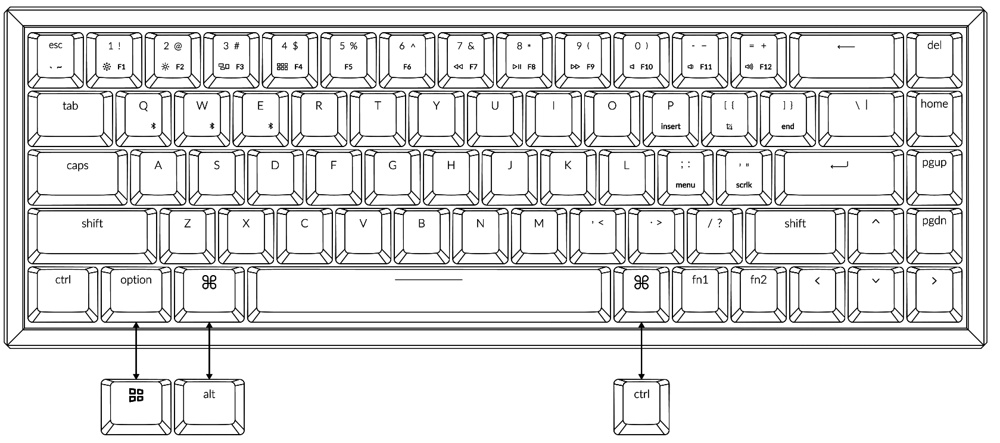

# K6 Shortcut CLI
Quick and easy command line tool which displays the list of keyboard shortcuts for the [Keychron K6](https://www.keychron.com/products/keychron-k6-non-backlight-wireless-mechanical-keyboard). I bought some aftermarket keycaps for this keyboard which understandably don't have the `fn1` and `fn2` mappings printed on the keys, so printing out a list of them in the terminal will be helpful instead of having to open up a picture of the keyboard.  

## The Keyboard:


## Usage:

**Display all mappings**
`ksc`
```
== Keychron K6 Shortcut Mappings ==

   brightness up.....fn1+1
   brightness down...fn1+2
   volume up.........fn1+=
   volume down.......fn1+-
   mute..............fn1+0
   play/pause........fn1+8
   previous track....fn1+7
   next track........fn1+9
   end...............fn1+]
   insert............fn1+P
   menu..............fn1+;
   show all..........fn1+3
   file explorer.....fn1+4
   scroll lock.......fn1+'
   F1................fn2+1
   F2................fn2+2
   F3................fn2+3
   F4................fn2+4
   F5................fn2+5
   F6................fn2+6
   F7................fn2+7
   F8................fn2+8
   F9................fn2+9
   F10...............fn2+0
   F11...............fn2+-
   F12...............fn2+=
```

**Display Individual Shortcut**
`ksc <shortcut_name>`
```
== Keychron K6 Shortcut Mappings ==

   previous track: fn1+7
```

- If supplied `shortcut_name` does not exist, you'll be told you messed up
- If you provide more than 1 argument, you'll be told you messed up
